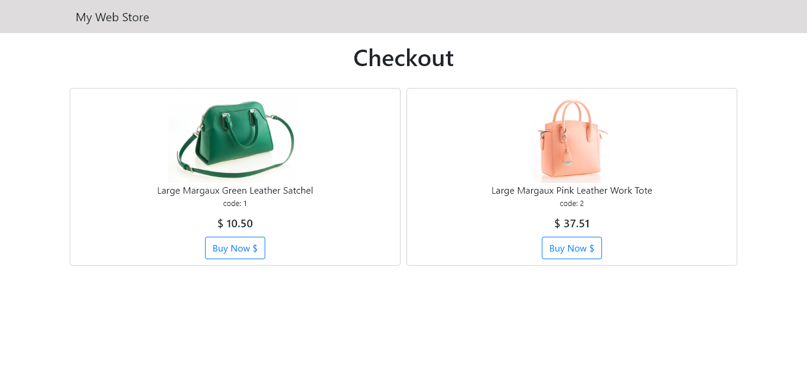

# Web Store

This is a simple Web Store project that uses [Paypal Express Checkout](https://developer.paypal.com/docs/checkout/).

## Setup

Clone the project and create the database.  :)

## This project uses

- Bootstrap
- Paypal Express Checkout
- Paypal SDK
- Paypal Sandbox
- MySQL
- PHP

## To do

- Organize code / files
- ESLint
- Add some validations for the form
- Save all client's inputs (shipping)
- Link client data with the transation
